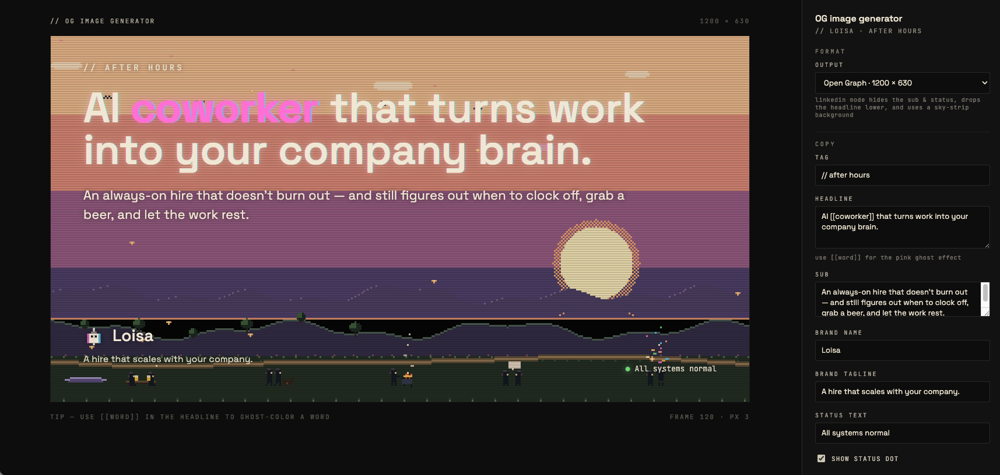

# OG-image-generator — a Claude Code skill

Generate a site-tailored **Open Graph / social card editor** for any web project, by introspecting the site's own design tokens, typography, brand mark, and signature visual treatments — then emitting a standalone HTML + JS Canvas editor that the team can hand-tune in the browser and export PNG cards from.

The output is a two-pane browser tool: canvas stage on the left, control panel on the right. It runs under the project's existing dev server. No new dependencies.



*Above: `/OG-image-generator` running on [loisa.ai](https://loisa.ai) — the maximalist example. The skill detected the site's pixel-art rendering, animated agents, sunset palette, chromatic-aberration headline ghosts, and status-pill convention, and built an editor with the full set of conditional controls on the right. A flatter site would get a much sparser editor.*

## Why

Most OG image tools are generic templates that look like every other OG image tool. This skill produces an editor that uses **the actual site's** CSS variables, fonts, and logo — so the exported social cards feel like the site, not like a Canva export.

The skill is opinionated about what makes a good OG image (1200×630, ≥4.5:1 contrast, ≤10-word headline, logo bottom-corner, one focal point) and a good editor (live preview at native resolution, a handful of controls not a dashboard, sensible defaults pulled from the site, one-click PNG export).

It was originally built for [loisa.ai](https://loisa.ai) (CRT + pixel-art aesthetic). The skill generalizes the pattern so it works on flat-and-minimal sites, gradient-heavy sites, pixel-art sites — anything. Anything site-specific (chromatic-aberration headline ghosts, scanline overlays, pixel-art renderers, animated backgrounds) is opt-in: the skill only adds a control if the site actually has that pattern in its source.

## What it does

Drops two files into your repo:

- An editor HTML page (placed where your dev server will pick it up — Vite root, Next `app/`, Astro `pages/`, etc.)
- A renderer JS module that draws the card and exports PNG

Both files reference your project's existing CSS variables, fonts, and logo. The skill fetches your logo from inline SVG, `<link rel="icon">`, common file paths (`public/logo.*`, `static/`, `assets/`), or a `Logo` component — and embeds it in the editor.

## Install

Skills live in `~/.claude/skills/`. To install:

```bash
git clone https://github.com/johancutych/OG-image-generator.git ~/.claude/skills/OG-image-generator
```

Or if you've already cloned the repo elsewhere:

```bash
cp -r path/to/OG-image-generator ~/.claude/skills/OG-image-generator
```

Restart Claude Code (or run `/skills` to refresh). The skill will appear as `OG-image-generator`.

## Use

In any web project, run:

```
/OG-image-generator
```

Claude will:

1. Detect your framework (Vite / Next / Astro / Eleventy / plain static)
2. Extract design tokens — `:root` CSS custom properties, `<head>` font links, Tailwind theme, or CSS-in-JS theme objects
3. Find and fetch your logo — inline SVG, `<link rel="icon">`, files in `public/` / `static/` / `assets/`, or a `Logo` component
4. Pull sample copy from your homepage hero
5. Generate the editor files in the right location for your framework
6. Tell you the URL to open

Then open the URL, tune the copy, and click **Export PNG**.

## Universal controls every editor ships with

- Headline (textarea)
- Subhead (textarea)
- Brand name (text)
- Show logo (checkbox)
- Theme (select — derived from your palette)
- Export PNG / Reset to defaults

That's the whole control panel. Five fields and two buttons. Nothing else by default.

## Conditional controls — principles, not a checklist

The universal panel is enough for most sites. A clean SaaS landing page with a single-tone background and a sans-serif h1 ships with the universal panel and nothing else.

For sites with distinctive visual treatments, the skill adds **one extra control per treatment** — never more — picking the control type that matches what the site does:

| Treatment category                              | Control type             |
|-------------------------------------------------|--------------------------|
| Time-based (animation, drift, motion)           | Frame / time slider      |
| Level-based (grain, blur, scanlines, vignette)  | Intensity slider         |
| Discrete modes (day/night, hero/footer, themes) | Variant select           |
| Per-glyph styling (hero h1 word emphasis)       | `[[word]]` markup        |
| Optional decoration (status pill, badge, tag)   | Checkbox                 |
| Resolution / scale (pixel-art, halftone)        | Single integer slider    |

The default is **"no extras"**. A maximalist site like loisa.ai (pixel-art + animated + CRT overlays + chromatic-aberration headline) ends up with ~7 conditional controls. Most sites get zero. If you find yourself adding more than that for one site, you're exposing engineering knobs instead of vibe controls.

Full principles and worked examples are in `SKILL.md`.

## Reference implementation

The [loisa-website repo](https://github.com/9roads/loisa-website) (this skill's birthplace) contains a hand-built example with most of the conditional add-ons turned on, because the site uses all of them:

- `og.html` — the editor shell
- `src/og.js` — the renderer (~970 lines, supports OG 1200×630 and LinkedIn banner 1584×396)

That implementation reuses the site's pixel-art renderer (`drawAfterHours` from `src/illustrations.js`) for the background, mirrors the headline's chromatic-aberration ghost effect from `src/styles.css`, and exports at native resolution. Read it for an example of what a maximalist version looks like — but most sites should get a much simpler editor.

## Constraints the skill enforces

- **Doesn't invent a vibe.** Flat sites get flat editors. Doesn't bolt on CRT scanlines because they look cool.
- **Single canvas size: 1200 × 630.** No multi-format sprawl unless you ask.
- **Reuses real code where possible.** If your site has a JS hero renderer, the editor imports it directly.
- **Webfonts load in the editor's `<head>`** — Canvas `fillText` only respects loaded fonts.
- **Re-renders after `document.fonts.ready`** so the first paint isn't in fallback fonts.
- **Doesn't add controls for treatments your site doesn't have** — no scanline slider on a site without scanlines.

## What's in SKILL.md

- An OG image best-practices brief (size, safe zone, legibility at thumbnail scale, contrast, brevity)
- An OG editor best-practices brief (live preview at native res, minimal controls, sensible defaults)
- The full workflow: survey repo → extract tokens → find logo → find optional treatments → extract sample copy → generate editor → verify
- Logo detection algorithm with format-by-format embedding (SVG / PNG / ICO / fallback)
- Per-framework file placement table (Vite / Next app / Next pages / Astro / Eleventy / plain static)
- Architecture reference code patterns (canvas resolution, state pipeline, logo render, headline wrap, PNG export, fonts ready)

## Files in this repo

- `SKILL.md` — the skill instructions Claude Code reads
- `README.md` — this file

## License

MIT.
